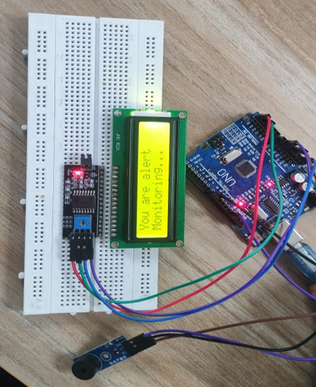

# Driver Drowsiness Detection

Real-Time Driver Drowsiness Detection using Computer Vision and Embedded Alert System designed to improve road safety by monitoring the driver's eye state and triggering alerts when drowsiness is detected.

The system uses Computer Vision, Deep Learning, TensorFlow Lite, and Arduino UNO to detect fatigue and provide immediate feedback through buzzer alerts and LCD notifications.

---

## How It Works

```
Webcam Feed → Face/Eye Detection (OpenCV) → Eye State Classification (TFLite Model)
     ↓
Consecutive closed frames? → Serial Signal → Arduino UNO → Buzzer + LCD Alert
```

1. A webcam continuously captures the driver's face
2. OpenCV isolates the eye region in real time
3. A quantized TensorFlow Lite model classifies each frame as **Open** or **Closed**
4. If eyes stay closed across N consecutive frames, drowsiness is flagged
5. Python sends a signal to the Arduino over serial
6. The Arduino fires a buzzer and prints a warning on the LCD

---

## Results

| Metric | Value |
|--------|-------|
| Classification Accuracy | ~96.5% |
| False Alarm Rate | < 1% |
| Alert Latency | Real-time (low ms) |

---

## Tech Stack

| Layer | Tools |
|-------|-------|
| Computer Vision | Python, OpenCV |
| ML Model | TensorFlow, TensorFlow Lite (quantized) |
| Hardware | Arduino UNO, LCD Display, Buzzer |
| Communication | PySerial (USB serial) |
| Firmware | C/C++ (Arduino IDE) |

---

## Project Structure

```
driver-drowsiness-detection/
│
├── dataset/          # Eye state image dataset (Open / Closed)
├── training/         # Model training scripts and notebooks
├── quantization/     # TFLite conversion and post-training quantization
├── detection/        # Real-time inference + serial communication (Python)
├── hardware/         # Arduino firmware (.ino sketch)
└── results/          # Evaluation metrics, confusion matrix, sample outputs
```

---

## Methodology

### Prerequisites

- Python 3.8+
- Arduino IDE
- A USB webcam
- Arduino UNO + LCD (I2C) + Buzzer

### Installation

```bash
git clone https://github.com/your-username/driver-drowsiness-detection.git
cd driver-drowsiness-detection
pip install -r requirements.txt
```

### Run

1. **Upload** `hardware/drowsiness_alert.ino` to your Arduino UNO via the Arduino IDE
2. **Connect** the Arduino via USB and note the COM port
3. **Start detection:**

---

## Hardware Setup

| Component | Pin |
|-----------|-----|
| Buzzer (+) | D8 |
| LCD SDA | A4 |
| LCD SCL | A5 |
| VCC / GND | 5V / GND |


---

## Model Details

- **Architecture:** Custom lightweight CNN
- **Input:** 24×24 grayscale eye crop
- **Output:** Binary — Open (0) / Closed (1)
- **Format:** `.tflite` (INT8 quantized)
- **Training data:** MRL Eye Dataset + custom augmentation

The model was quantized post-training to reduce size and inference time, making it suitable for resource-constrained edge deployments.

---

## Circuit Diagram


## Workflow


## Project Setup


## Demo Video

Watch the live project demonstration here:  
(https://youtube.com/shorts/F3qtn-yRcPo)


## Features

- Real-time webcam-based eye monitoring
- Eye-state classification using deep learning
- Quantized TensorFlow Lite model for lightweight inference
- Arduino-based buzzer alert system
- LCD display for driver status feedback
- Serial communication between Python and Arduino
- Low-latency real-time drowsiness detection

## Future Enhancements

- Yawning detection using mouth aspect ratio
- Head pose estimation for distraction detection
- GPS integration for emergency location alerts
- Cloud logging / IoT dashboard (MQTT)
- Mobile companion application

---

## Authors

- **Mithal P Shetty**
- **Prathima B A** 
- **Pullangati Shivaraj** 

---

## License

MIT License — see [LICENSE](LICENSE) for details.

---
